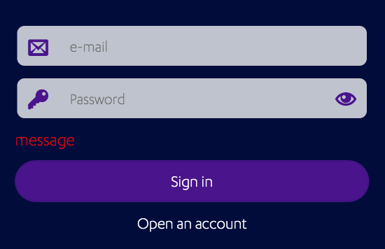

# Login

This project showcases an example of how to build *Reusable Login Fields
Component* using *Kony Visualizer*. The Visualizer project just serves as a
wrapper to demo the component. The component -called
`com.mig82.Login` is the real focus of this exercise.

## External Dependencies

This project uses a fork of AmplifyJs's core module. This is bundled within the component
so once the component is imported this Javascript module will be added to the
project's global `modules` directory.

## Implementation Notes

This project was built using Kony Visualizer Visualizer 8.4.22.
